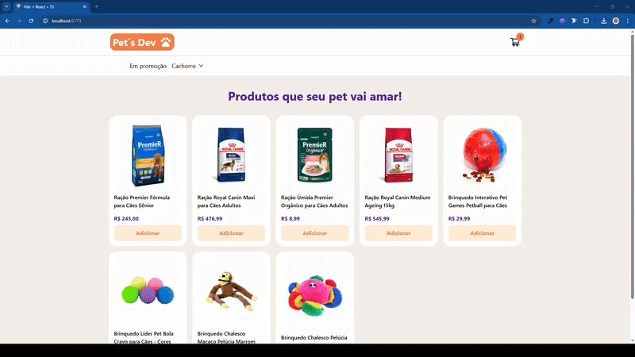
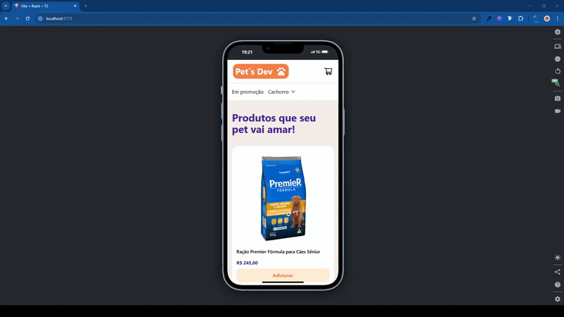
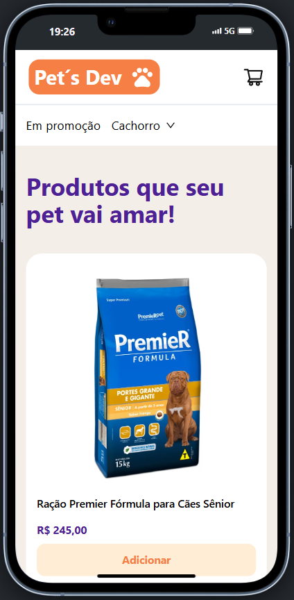
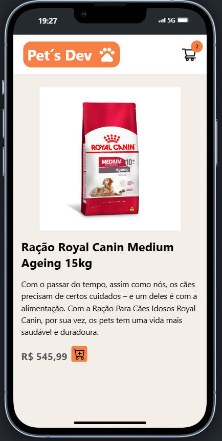
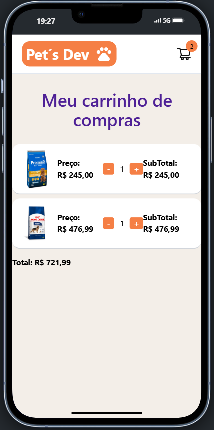
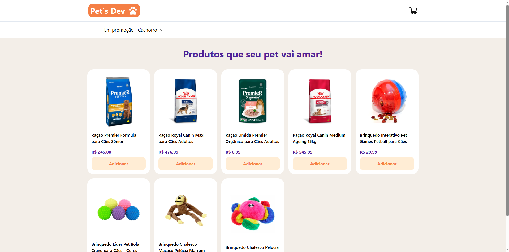
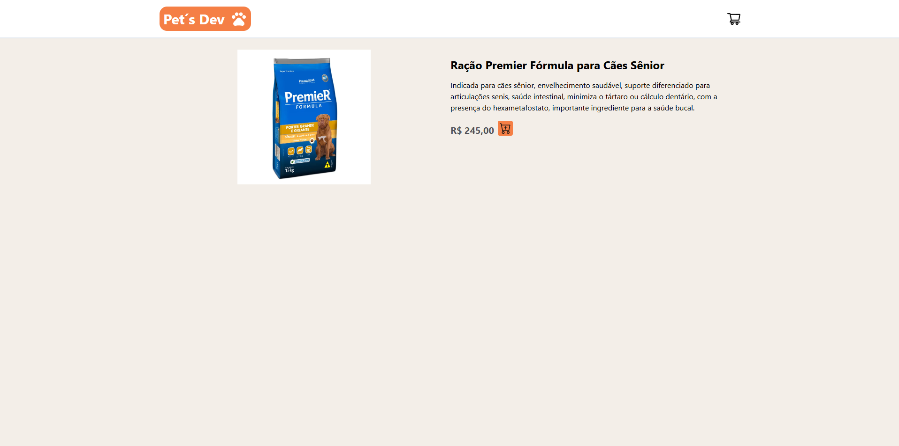
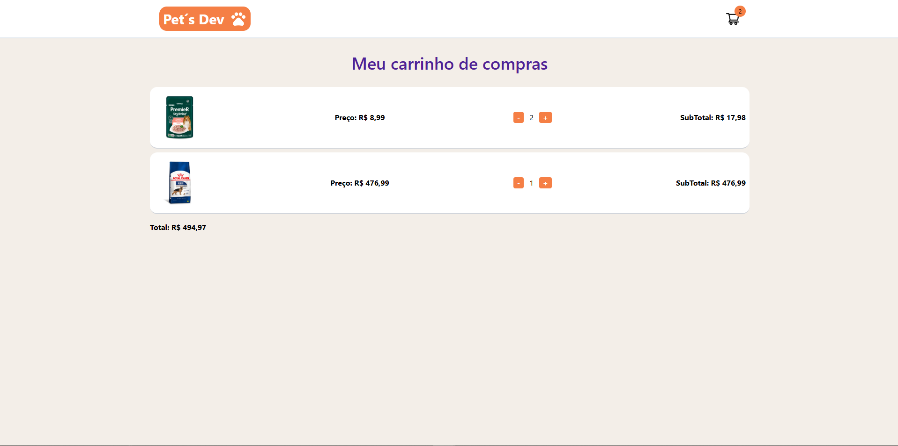

# Pet´s Dev




**Pet´s Dev** é um protótipo de aplicação e-commerce desenvolvida com foco em práticas profissionais de desenvolvimento front-end, utilizando React, Axios, Toast, e ContextAPI para demonstrar na prática como estruturar um site de compras moderno, escalável e fácil de manter.

## Sumário

1. [Visão Geral do Projeto](#visão-geral-do-projeto-funcionalidades-principais)
   - [Produtos consumidos via API](#1-produtos-consumidos-via-api)
   - [Componentização das principais DOMs da aplicação](#2-componentização-das-principais-doms-da-aplicação)
   - [ContextAPI para gerenciamento do carrinho de compras](#3-contextapi-para-gerenciamento-do-carrinho-de-compras)
2. [Tecnologias Utilizadas](#tecnologias-utilizadas-linguagens-e-ferramentas)
3. [Estrutura do Projeto](#estrutura-do-projeto)
5. [Screenshots](#screenshots)
   - [Mobile](#mobile)
   - [Web](#web)
6. [Requisitos para Rodar o Projeto Localmente](#requisitos-para-rodar-o-projeto-localmente)
7. [Rodar o Projeto Localmente](#rodar-o-projeto-localmente)
8. [Autores](#autores)
9. [Licença](#licença)

## Visão Geral do Projeto (Funcionalidades Principais)

### 1. Produtos consumidos via API:

- Renderização condicional, dependente dos dados vindo via API, que no caso, é um JSON formatado com os produtos dos quais são acessados.

### 2. Componentização das principais DOMs da aplicação:

- Componentização de elementos para padronização e boas práticas do código, algo essencial de usar no ReactJS.

### 3. ContextAPI para gerenciamento do carrinho de compras:

- Uso do ContextAPI do React para gerenciamento de estados globalmente na aplicação, no caso, o carrinho de compras.

## Tecnologias Utilizadas (Linguagens e ferramentas)

<table>
    <tr>
      <td align="center">
        <a href="https://react.dev/">
          
          <br />
          <sub>
            <b>ReactJS</b>
          </sub>
        </a>
      </td>
      <td align="center">
        <a href="https://tailwindcss.com/">
          
          <br />
          <sub>
            <b>TailwindCSS</b>
          </sub>
        </a>
      </td>
    </tr>
</table>
<table border-style="none">
  <tr>
    <td align="center">
      <a href="https://git-scm.com/">
        <br />
        <sub>
          <b>Git</b>
        </sub>
      </a>
    </td>
  </tr>
</table>

## Estrutura do Projeto

O projeto é organizado em vários arquivos para melhor organização do código e separação de interesses:

- `/public`: É a pasta responsável pelas imagens públicas que compõem o visual do site;
- `/src/components`: É a pasta responsável pelos componentes da aplicação;
- `/src/contexts`: É a pasta responsável pela estruturação do ContextAPI para o acesso global do dados;
- `/src/pages`: É a pasta responsável pelo aplicativo da aplicação, onde estruturamos as páginas e seus dados;
- `/src/pages`: É a pasta responsável pela configuração do acesso via API das rotas da aplicação.

## Screenshots

### Mobile





### Web





## Requisitos para Rodar o Projeto Localmente

### Git:

- Certifique-se de ter o Git instalado em sua máquina. Se não tiver, você pode baixá-lo aqui.

### Editor de Texto ou IDE:

- Escolha um editor de texto ou uma IDE (Ambiente de Desenvolvimento Integrado) para trabalhar no código. Alguns exemplos populares incluem o Visual Studio Code, Sublime Text e Atom.

### Navegador Web:

- Você precisará de um navegador web para visualizar o aplicativo localmente. Recomendamos o uso do Google Chrome, Mozilla Firefox ou Microsoft Edge.

### Utilização de alguma extensaõ para rodar localmente seu HTML:

- Recomendo a utilização da extensão do VSCode chamada Live Server.

## Rodar o Projeto Localmente

**Clone o projeto**

```bash
  git clone https://github.com/MarcioJorgeMelo/dev-petShop.git
```

**Vá para a pasta do projeto**

```bash
  cd petdev
```

**Abra o projeto no VSCode**

```bash
  code .
```

**Colocar o Json-Server para rodar**

```bash
  json-server --watch db.json
```

## Autores

- [@MarcioJorgeMelo](https://github.com/MarcioJorgeMelo)

## Licença

- [MIT](https://choosealicense.com/licenses/mit/)
